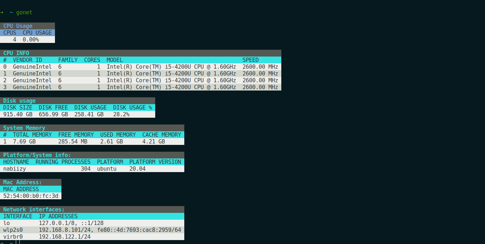

# GONET


<div style="display:flex; align-items:baseline; gap:4px">

[](https://go.dev/)

[](https://github.com/abiiranathan/gonet)

</div>

A simple go network tool that prints information about your system,
cpu information, memory usage, disk usage, network interfaces & MAC address.

This tool is built on top of [GO PSUTIL](https://github.com/shirou/gopsutil).

Table printing is done using this nifty library called [GO PRETTYTABLE](https://github.com/jedib0t/go-pretty).




## Installation (binary)
```bash

git clone https://github.com/abiiranathan/gonet.git

cd gonet
go build -ldflags "-w -s" cmd/gonet.go

./gonet
```

### API Usage
```bash

go get github.com/abiiranathan/gonet
```

### Dump metrics to stdout
```go
package main

import (
	"os"

	"github.com/abiiranathan/gonet"
)


func main() {
	gonet.WriteMetrics(os.Stdout)

  // Replace os.Stdout with any io.Writer interface
}
```


### Raw metrics
```go
metrics := gonet.ReadMetrics()
fmt.Printf("Mem Total: %d", metrics.TotalMemory)
```